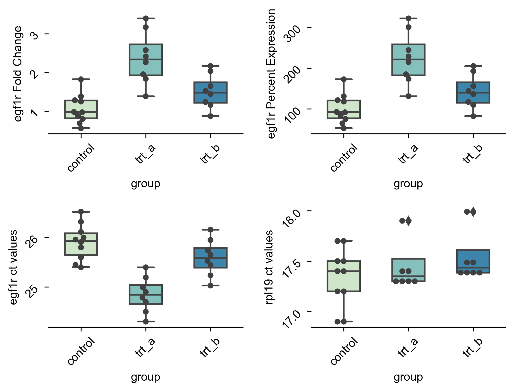

Pycr documentation
=====================================
A small utility package to automate relative quantification of mRNA from thermocycler cycle threshold (ct) data. Takes as input raw ct values for target and reference genes from experiment and control conditions and returns as output the fold changes in gene expression using the delta delta ct method. 

|dgr| 

Installation::

    $ python -m pip install git+https://github.com/pkmklong/pycr.git

Running pycr::

    $ pycr -h

        usage: pycr [-h] file_path experimental control

        positional arguments:
            file_path     The path to ct data (csv) for relative RNA quantification 
            control       The name of your control group
            
        optional arguments:
            -h, --help    show this help message and exit

Input data dictionary::

    {column name:  type    description}
    group:         str     Names of comparison groups.
    target:        float   ct values of target transcript.
    normalizer:    float   ct values of housekeeping transcript.

Fold change:

Demo::

    $ pycr  ./data/demo_data_extended.csv control 

    INFO:pycr:Loading table: ./data/demo_data_extended.csv
    INFO:pycr:Formatting table
    INFO:pycr:Saving output table: data/demo_data_extended_processed.csv
    INFO:pycr:Saving output figure: data/demo_data_extended_processed.png

.. note::
    Currently assumes perfect amplification efficiency and unpaired samples.

.. include:: isogrk1.txt

.. toctree::
   :maxdepth: 2
   :caption: Contents:
   
   license

Indices and tables
==================

* :ref:`genindex`
* :ref:`modindex`
* :ref:`search`
