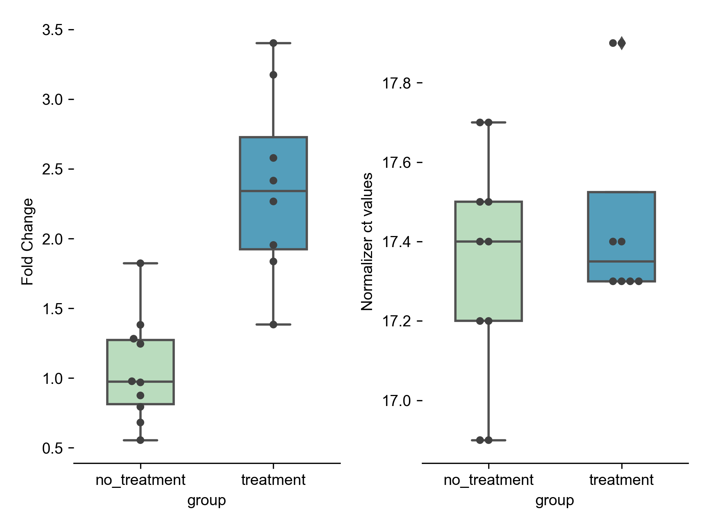

Pycr documentation
=====================================
A small utility package to automate relative quantification of mRNA from thermocycler ct data. 

Installation::

    $ python -m pip install git+https://github.com/pkmklong/pycr.git

Running pycr::

    $ pycr -h

        usage: pycr [-h] file_path experimental control

        positional arguments:
            file_path     The path to a ct data (csv) for relative RNA quantification 
            experimental  The name of your experimental group
            control       The name of your control group
            
        optional arguments:
            -h, --help    show this help message and exit

Demo::

    $ pycr  ./data/demo_data.csv treatment no_treatment

    INFO:pycr:Loading table: ./data/demo_data.csv
    INFO:pycr:Formatting table
    INFO:pycr:Saving output table: data/demo_data_processed.csv
    INFO:pycr:Saving output figure: data/demo_data_processed.png

.. toctree::
   :maxdepth: 2
   :caption: Contents:
   
   license

Indices and tables
==================

* :ref:`genindex`
* :ref:`modindex`
* :ref:`search`
